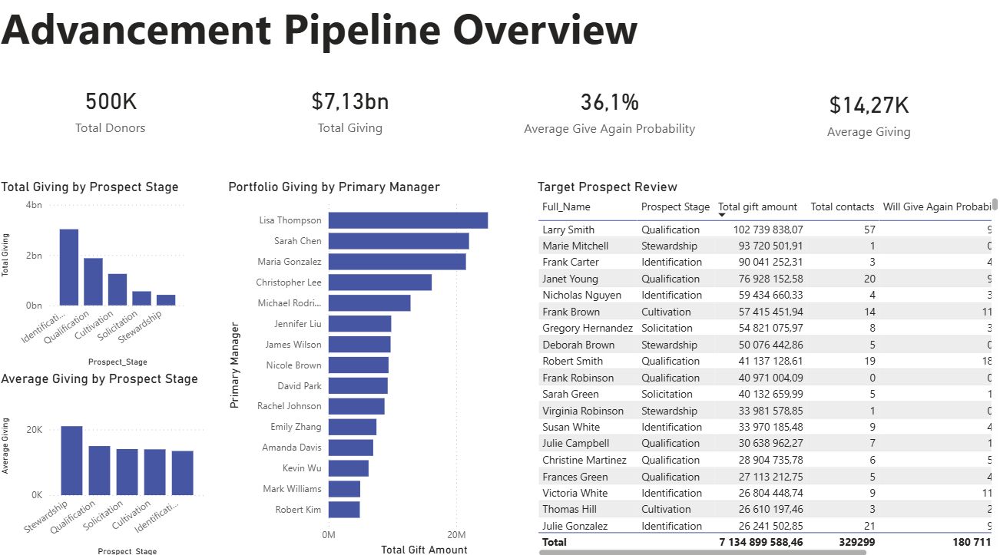

# Advancement Pipeline Business Intelligence Dashboard

## Overview

This project presents an end-to-end business intelligence workflow built around synthetic donor and fundraising pipeline data. The goal was to transform multiple raw source files into a stakeholder-facing dashboard that supports pipeline analysis, portfolio evaluation, and prospecting decisions.

The final deliverable includes:
- a cleaned donor-level reporting table
- SQL-based business analysis
- an interactive Power BI dashboard
- an executive summary report

## Dashboard Preview



## Business Problem

Advancement and fundraising teams need clear visibility into donor pipeline health, manager portfolio performance, and under-engaged but promising prospects. Raw donor activity, giving, event, and relationship data often lives across multiple files and is not immediately usable for decision-making.

This project addresses that problem by building a reporting-ready dataset and dashboard focused on:
- donor pipeline stages
- portfolio giving by primary manager
- average donor value by stage
- target prospect review for actionable follow-up

## Data Sources

The analysis was built from synthetic datasets representing:

- **Donors**: donor profile, stage, rating, and giving-related attributes
- **Giving**: transaction-level donation records
- **Contacts**: outreach activity and outcomes
- **Events**: donor attendance history
- **Relationships**: donor network and relationship strength indicators

## Tools Used

- **Python**
- **Pandas**
- **Jupyter Notebook**
- **SQLite / SQL**
- **Power BI**

## Workflow

1. Raw CSV files were inspected and profiled in Jupyter Notebook.
2. Data types were cleaned and standardized using Pandas.
3. Donor-level summaries were created for giving, contact activity, event attendance, and relationships.
4. A unified reporting table, `prospect_pipeline`, was built for downstream analysis.
5. SQL queries were written to answer key business questions related to stages, manager portfolios, donor segments, and target prospects.
6. A Power BI dashboard was developed to present executive KPIs and stakeholder-facing visuals.

## Dashboard KPIs

The dashboard highlights:

- **Total Donors**: 500,000
- **Total Giving**: approximately $7.13B
- **Average Give-Again Probability**: approximately 36.1%
- **Average Giving**: approximately $14.27K

## Key Findings

- The **Identification** stage contains the largest donor volume and the highest total giving, representing the widest part of the pipeline.
- The **Stewardship** stage has the highest average giving per donor, indicating strong value from retained donors.
- Portfolio sizes are relatively consistent across primary managers, making **portfolio value** and **average donor value** more useful comparison metrics than count alone.
- The **High Probability, Low Outreach** segment represents the clearest immediate opportunity for targeted prospecting action.
- A refined target prospect review helps surface donors with meaningful giving history and limited outreach activity.

## Dashboard Components

The Power BI dashboard includes:

- KPI cards for donor count, total giving, average give-again probability, and average giving
- total giving by prospect stage
- average giving by prospect stage
- portfolio giving by primary manager
- target prospect review table

## Project Structure

```text
uva-advancement-bi-dashboard/
├── dashboards/
│   ├── powerbi_dashboard.pbix
│   └── KPI screenshot.png
├── data/
│   ├── raw/
│   └── processed/
├── notebooks/
│   └── 01_data_inspection.ipynb
├── report/
│   └── executive_summary.md
├── sql/
│   ├── 01_stage_summary.sql
│   ├── 02_manager_summary.sql
│   ├── 03_priority_summary.sql
│   ├── 04_under_engaged.sql
│   └── 05_target_prospects.sql
└── README.md
